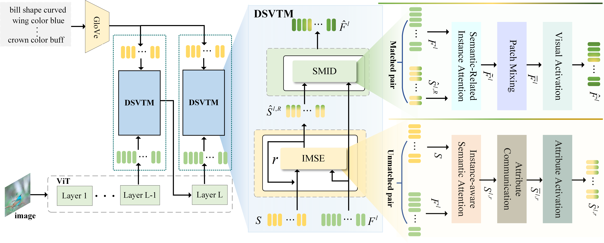

# PSVMA
   [](https://pytorch.org/) [](https://arxiv.org/abs/2303.15322)

 - [*Progressive Semantic-Visual Mutual Adaption for Generalized Zero-Shot Learning*](https://arxiv.org/abs/2303.15322)
  This repository contains the reference code for the paper "**Progressive Semantic-Visual Mutual Adaption for Generalized Zero-Shot Learning**" accepted to CVPR 2023.

  **Code will be uploaded before CVPR 2023 (mid-June). Please stay tuned!**

## 🌈 Model Architecture



## 📚 Dependencies

- ```Python 3.6.7```
- ```PyTorch = 1.7.0```
- All experiments are performed with one RTX 3090Ti GPU.

# ⚡ Prerequisites
- **Dataset**: please download the dataset, i.e., [CUB](http://www.vision.caltech.edu/visipedia/CUB-200-2011.html), [AWA2](https://cvml.ist.ac.at/AwA2/), [SUN](https://groups.csail.mit.edu/vision/SUN/hierarchy.html) to the dataset root path on your machine
- **Data split**: Datasets can be download from [Xian et al. (CVPR2017)](https://datasets.d2.mpi-inf.mpg.de/xian/xlsa17.zip) and take them into dir ```../../datasets/```.
- **Attribute w2v**:```extract_attribute_w2v_CUB.py``` ```extract_attribute_w2v_SUN.py``` ```extract_attribute_w2v_AWA2.py``` should generate and place it in ```w2v/```.
- Download pretranined vision Transformer as the vision encoder.

## 🚀 Train & Eval
Before running commands, you can set the hyperparameters in config on different datasets: 
```
config/cub.yaml       #CUB
config/sun.yaml      #SUN
config/awa2.yaml    #AWA2
```
The training:
```shell
 python train.py
```
You can test our trained model: [CUB](https://pytorch.org/), [AwA2](https://pytorch.org/), [SUN](https://pytorch.org/).

## ❗ Cite:
If this work is helpful for you, please cite our paper.

```
@InProceedings{Liu_2023_CVPR,
    author    = {Man Liu and Feng Li and Chunjie Zhang and Yunchao Wei and Huihui Bai and Yao Zhao},
    title     = {Progressive Semantic-Visual Mutual Adaption for Generalized Zero-Shot Learning},
    booktitle = {Proceedings of the IEEE/CVF International Conference on Computer Vision (CVPR)},
    year      = {2023},
}
```

## 📕 Ackowledgement
We thank the following repos providing helpful components in our work.
[GEM-ZSL](https://github.com/osierboy/GEM-ZSL)
